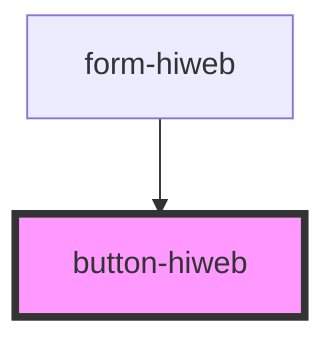

# button-hiweb-component

<!-- Auto Generated Below -->

## Properties

| Property | Attribute | Description | Type     | Default     |
| -------- | --------- | ----------- | -------- | ----------- |
| `title`  | `title`   |             | `string` | `undefined` |

## Events

| Event     | Description | Type               |
| --------- | ----------- | ------------------ |
| `onClick` |             | `CustomEvent<any>` |

## Dependencies

### Used by

 - [form-hiweb](../form-hiweb)

### Graph

----------------------------------------------

*Built with [StencilJS](https://stenciljs.com/)*
