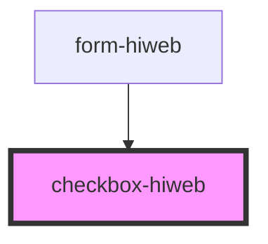

# checkbox-hiweb

<!-- Auto Generated Below -->

## Properties

| Property | Attribute | Description | Type      | Default     |
| -------- | --------- | ----------- | --------- | ----------- |
| `color`  | `color`   |             | `string`  | `'black'`   |
| `value`  | `value`   |             | `boolean` | `undefined` |

## Events

| Event      | Description | Type                   |
| ---------- | ----------- | ---------------------- |
| `onChange` |             | `CustomEvent<boolean>` |

## Dependencies

### Used by

 - [form-hiweb](../form-hiweb)

### Graph

----------------------------------------------

*Built with [StencilJS](https://stenciljs.com/)*
