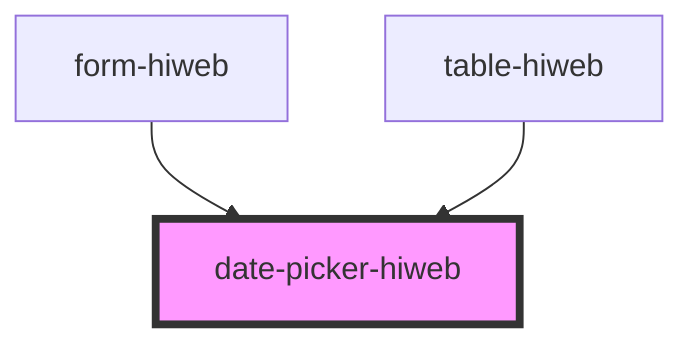

# date-picker-hiweb

<!-- Auto Generated Below -->

## Properties

| Property   | Attribute   | Description | Type      | Default     |
| ---------- | ----------- | ----------- | --------- | ----------- |
| `color`    | `color`     |             | `string`  | `'#DDDFE0'` |
| `label`    | `label`     |             | `string`  | `'تاریخ'`   |
| `maxWidth` | `max-width` |             | `boolean` | `false`     |
| `value`    | `value`     |             | `string`  | `undefined` |

## Events

| Event           | Description | Type                  |
| --------------- | ----------- | --------------------- |
| `gregorianDate` |             | `CustomEvent<string>` |
| `jalaiDate`     |             | `CustomEvent<string>` |

## Dependencies

### Used by

 - [form-hiweb](../form-hiweb)
 - [table-hiweb](../table-hiweb)

### Graph

----------------------------------------------

*Built with [StencilJS](https://stenciljs.com/)*
