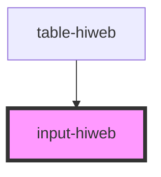

# esteghlal-input

<!-- Auto Generated Below -->

## Properties

| Property        | Attribute      | Description | Type      | Default     |
| --------------- | -------------- | ----------- | --------- | ----------- |
| `label`         | `label`        |             | `string`  | `undefined` |
| `placeHolder`   | `place-holder` |             | `string`  | `undefined` |
| `title`         | `title`        |             | `string`  | `undefined` |
| `valid`         | `valid`        |             | `boolean` | `undefined` |
| `validatorProp` | `validator`    |             | `string`  | `undefined` |
| `valueProp`     | `value-prop`   |             | `string`  | `undefined` |

## Events

| Event     | Description | Type                                                               |
| --------- | ----------- | ------------------------------------------------------------------ |
| `changed` |             | `CustomEvent<{ title: string; value: string; isValid: boolean; }>` |

## Methods

### `validate() => Promise<void>`

#### Returns

Type: `Promise<void>`

## Dependencies

### Used by

 - [table-hiweb](../table-hiweb)

### Graph

----------------------------------------------

*Built with [StencilJS](https://stenciljs.com/)*
