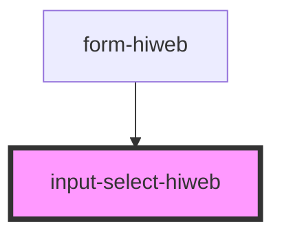

# input-select-hiweb

<!-- Auto Generated Below -->

## Properties

| Property        | Attribute      | Description | Type                                                     | Default                                                                                                                                                                                                               |
| --------------- | -------------- | ----------- | -------------------------------------------------------- | --------------------------------------------------------------------------------------------------------------------------------------------------------------------------------------------------------------------- |
| `checkInput`    | `check-input`  |             | `boolean`                                                | `undefined`                                                                                                                                                                                                           |
| `color`         | `color`        |             | `string`                                                 | `'#DDDFE0'`                                                                                                                                                                                                           |
| `options`       | --             |             | `{ value: string \| number; text: string \| number; }[]` | `[{value: 'sdfsdf1', text: 'sfsdf'}, {value: 'sdfsdf2', text: 'sfsdf3'}, {value: 'sdfsdf4', text: 'sfsdf5'}, {value: 'sdfsdf6', text: 'sfsdf'}, {value: 'sdfs7df', text: 'sfsdf'}, {value: 'sdfsdf', text: 'sfsdf'}]` |
| `placeHolder`   | `place-holder` |             | `string`                                                 | `'please select'`                                                                                                                                                                                                     |
| `selectedValue` | --             |             | `{ value: string \| number; text: string \| number; }`   | `undefined`                                                                                                                                                                                                           |
| `title`         | `title`        |             | `string`                                                 | `''`                                                                                                                                                                                                                  |

## Events

| Event          | Description | Type                                                                |
| -------------- | ----------- | ------------------------------------------------------------------- |
| `valueChanged` |             | `CustomEvent<{ value: string \| number; text: string \| number; }>` |

## Dependencies

### Used by

 - [form-hiweb](../form-hiweb)

### Graph

----------------------------------------------

*Built with [StencilJS](https://stenciljs.com/)*
