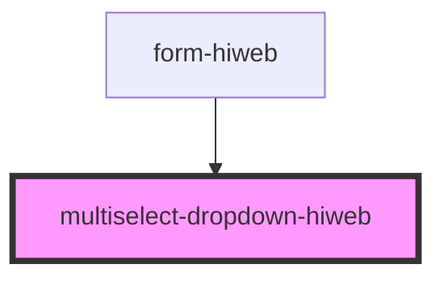

# multiselect-dropdown-hiweb

<!-- Auto Generated Below -->

## Properties

| Property | Attribute | Description | Type                                                             | Default     |
| -------- | --------- | ----------- | ---------------------------------------------------------------- | ----------- |
| `api`    | --        |             | `{ url: string; query: string; field: string; token?: string; }` | `undefined` |
| `items`  | --        |             | `Item[]`                                                         | `[]`        |
| `label`  | `label`   |             | `string`                                                         | `undefined` |

## Events

| Event      | Description | Type                                |
| ---------- | ----------- | ----------------------------------- |
| `onChange` |             | `CustomEvent<(string \| number)[]>` |

## Dependencies

### Used by

 - [form-hiweb](../form-hiweb)

### Graph

----------------------------------------------

*Built with [StencilJS](https://stenciljs.com/)*
