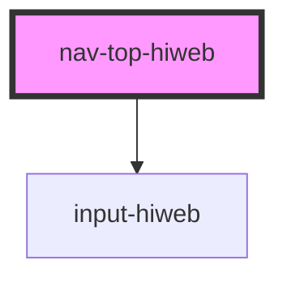

# nav-top-hiweb

<!-- Auto Generated Below -->

## Properties

| Property | Attribute | Description | Type                                                      | Default                                                                                                                                                                                                                                            |
| -------- | --------- | ----------- | --------------------------------------------------------- | -------------------------------------------------------------------------------------------------------------------------------------------------------------------------------------------------------------------------------------------------- |
| `items`  | --        |             | `{ icon: string; notification: number; path: string; }[]` | `[     {       icon: 'logout',       notification: 0,       path: '/logout'     },     {       icon: 'bell',       notification: 3,       path: '/'     }   ]`                                                                                     |
| `user`   | --        |             | `{ fullName: string; info: string; imageUrl: any; }`      | `{     fullName: 'امیرعلی محمدی',     info: 'نمی‌دونم',     imageUrl: 'https://thumbs.dreamstime.com/b/default-avatar-photo-placeholder-profile-picture-default-avatar-photo-placeholder-profile-picture-eps-file-easy-to-edit-125707135.jpg'   }` |

## Events

| Event     | Description | Type               |
| --------- | ----------- | ------------------ |
| `onClick` |             | `CustomEvent<any>` |
| `search`  |             | `CustomEvent<any>` |

## Dependencies

### Depends on

- [input-hiweb](../input-hiweb)

### Graph

----------------------------------------------

*Built with [StencilJS](https://stenciljs.com/)*
