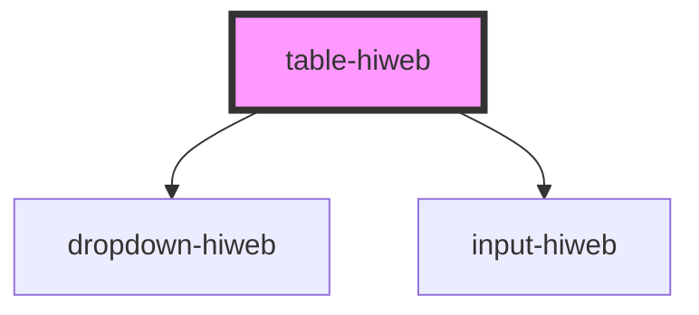

# table-hiweb

<!-- Auto Generated Below -->

## Properties

| Property         | Attribute         | Description | Type                                                                                                          | Default                                                                         |
| ---------------- | ----------------- | ----------- | ------------------------------------------------------------------------------------------------------------- | ------------------------------------------------------------------------------- |
| `checkbox`       | `checkbox`        |             | `boolean`                                                                                                     | `true`                                                                          |
| `dataProp`       | --                |             | `{ head: { title: string; options: string[]; colspan: number; }[]; body: { type: string; data: any; }[][]; }` | `undefined`                                                                     |
| `dataStringProp` | `datastring`      |             | `string`                                                                                                      | `undefined`                                                                     |
| `info`           | --                |             | `{ title: string; content: string; }[]`                                                                       | `[{ title: 'تعداد', content: '۲۳۴۲۳۴' }, { title: 'نام', content: 'امیرعلی' }]` |
| `numberOfRows`   | `number-of-rows`  |             | `number`                                                                                                      | `20`                                                                            |
| `orderBy`        | --                |             | `{ order: string; options: string[]; }`                                                                       | `{ order: 'زمان', options: ['بازدید', 'سیبیب', 'سیبسبیسیبسیب', 'سشیبسیب'] }`    |
| `page`           | `page`            |             | `number`                                                                                                      | `3`                                                                             |
| `range`          | --                |             | `number[]`                                                                                                    | `[5, 10, 20, 50, 100, 200]`                                                     |
| `totalDocuments` | `total-documents` |             | `number`                                                                                                      | `100`                                                                           |

## Events

| Event                | Description | Type                                                                             |
| -------------------- | ----------- | -------------------------------------------------------------------------------- |
| `buttonClicked`      |             | `CustomEvent<string \| { text: string; detail: string; }>`                       |
| `handleCheckbox`     |             | `CustomEvent<{ allSelected: boolean; } \| { index: number; checked: boolean; }>` |
| `orderChanged`       |             | `CustomEvent<string>`                                                            |
| `pageChanged`        |             | `CustomEvent<number>`                                                            |
| `rowNumChanged`      |             | `CustomEvent<number>`                                                            |
| `searchInputChanged` |             | `CustomEvent<{ title: string; value: string; isValid: boolean; }>`               |

## Dependencies

### Depends on

- [dropdown-hiweb](../dropdown-hiweb)
- [input-hiweb](../input-hiweb)

### Graph

----------------------------------------------

*Built with [StencilJS](https://stenciljs.com/)*
